# 🏢 HRMS — Human Resource Management System

> Java EE Web Application | Maven | Docker | Terraform | AKS | GitHub Actions CI/CD

---

## 📋 Table of Contents

1. [Project Overview](#-project-overview)
2. [Project Structure](#-project-structure)
3. [Architecture Diagram](#-architecture-diagram)
4. [CI/CD Pipeline Flow](#-cicd-pipeline-flow)
5. [Step 1 — Build the Package (Maven)](#-step-1--build-the-package-maven)
6. [Step 2 — Dockerfile & Containerization](#-step-2--dockerfile--containerization)
7. [Step 3 — Create AKS Infrastructure (Terraform)](#-step-3--create-aks-infrastructure-terraform)
8. [Step 4 — Deploy to Kubernetes](#-step-4--deploy-to-kubernetes)
9. [Step 5 — CI/CD Automation (GitHub Actions)](#-step-5--cicd-automation-github-actions)
10. [GitHub Secrets Setup](#-github-secrets-setup)
11. [Check Application Status](#-check-application-status)
12. [Access the Application](#-access-the-application)

---

## 📌 Project Overview

HRMS is a Java EE web application built with JSP/Servlets running on Apache Tomcat 9. It manages employees, departments, leave requests, payroll, and project assignments.

| Technology     | Tool/Version              |
|----------------|---------------------------|
| Language       | Java 11                   |
| Framework      | Java EE (JSP + Servlets)  |
| Build Tool     | Maven 3.x                 |
| Server         | Apache Tomcat 9.0         |
| Database       | MySQL 8.x                 |
| Container      | Docker                    |
| Registry       | Docker Hub                |
| Infra          | Terraform + Azure AKS     |
| CI/CD          | GitHub Actions            |

---

## 📁 Project Structure

```
HRMS-Project-java/
├── .github/
│   └── workflows/
│       └── cicd.yml              ← GitHub Actions CI/CD pipeline
├── Human Resource Management/
│   ├── src/
│   │   └── com/HRmanagementsystem/
│   │       ├── dao/              ← Data Access Layer
│   │       ├── model/            ← Entity classes
│   │       ├── web/              ← Servlets
│   │       ├── DB_util/          ← DB connection
│   │       └── exception/        ← Custom exceptions
│   └── WebContent/
│       ├── WEB-INF/
│       │   └── web.xml           ← Servlet configuration
│       └── *.jsp                 ← JSP pages
├── k8s/
│   ├── deployment.yaml           ← Kubernetes Deployment
│   └── service.yaml              ← Kubernetes LoadBalancer Service
├── terraform/
│   └── main.tf                   ← AKS cluster infrastructure
├── Dockerfile                    ← Docker image definition
├── pom.xml                       ← Maven build configuration
└── README.md
```

---

## 🏗️ Architecture Diagram

```
┌─────────────────────────────────────────────────────────────────┐
│                        DEVELOPER                                │
│                    git push → main                              │
└─────────────────────────┬───────────────────────────────────────┘
                          │
                          ▼
┌─────────────────────────────────────────────────────────────────┐
│                   GITHUB ACTIONS CI/CD                          │
│                                                                 │
│  ┌──────────┐   ┌─────────────┐   ┌───────────┐   ┌────────┐  │
│  │  Build   │──▶│Build Docker │──▶│ Terraform │──▶│Deploy  │  │
│  │  & Test  │   │   Image     │   │ AKS Infra │   │to AKS  │  │
│  │  Maven   │   │  Push to    │   │  Create   │   │kubectl │  │
│  └──────────┘   │  Docker Hub │   │  Cluster  │   │ apply  │  │
│                 └─────────────┘   └───────────┘   └────────┘  │
└─────────────────────────────────────────────────────────────────┘
                          │                              │
                          ▼                              ▼
              ┌───────────────────┐        ┌────────────────────────┐
              │    DOCKER HUB     │        │    AZURE AKS CLUSTER   │
              │  lucky89788/hrms  │        │       (myRG / East)    │
              │  :latest          │        │                        │
              │  :<git-sha>       │        │  ┌──────────────────┐  │
              └───────────────────┘        │  │  hrms-deployment │  │
                                           │  │  replicas: 2     │  │
                                           │  │  Tomcat:9 + WAR  │  │
                                           │  └──────────────────┘  │
                                           │           │            │
                                           │  ┌────────▼─────────┐  │
                                           │  │  LoadBalancer    │  │
                                           │  │  Service port:80 │  │
                                           │  └────────┬─────────┘  │
                                           └───────────┼────────────┘
                                                       │
                                                       ▼
                                           ┌───────────────────────┐
                                           │  http://<EXTERNAL-IP> │
                                           │  Browser / Users      │
                                           └───────────────────────┘
```

---

## 🔄 CI/CD Pipeline Flow

```mermaid
flowchart TD
    A([👨‍💻 Developer pushes to main]) --> B

    B[🔁 GitHub Actions Triggered]

    B --> C[JOB 1: Build & Test]
    C --> C1[Checkout Code]
    C1 --> C2[Setup JDK 11]
    C2 --> C3[mvn clean package]
    C3 --> C4[mvn test]
    C4 --> C5[Upload hrms.war artifact]

    C5 --> D[JOB 2: Build Docker Image]
    D --> D1[Checkout Code]
    D1 --> D2[Download hrms.war]
    D2 --> D3[Docker Login → Docker Hub]
    D3 --> D4[docker build]
    D4 --> D5[docker push :latest + :sha]

    D5 --> E[JOB 3: Provision AKS]
    E --> E1[Checkout Code]
    E1 --> E2[Azure Login]
    E2 --> E3[terraform init]
    E3 --> E4[terraform plan]
    E4 --> E5[terraform apply → AKS Created]

    E5 --> F[JOB 4: Deploy to AKS]
    F --> F1[Checkout Code]
    F1 --> F2[Setup kubectl]
    F2 --> F3[Write KUBE_CONFIG to ~/.kube/config]
    F3 --> F4[kubectl apply deployment.yaml]
    F4 --> F5[kubectl apply service.yaml]
    F5 --> F6[kubectl rollout status]
    F6 --> F7([✅ App Live on LoadBalancer IP])

    style A fill:#4CAF50,color:#fff
    style F7 fill:#4CAF50,color:#fff
    style C fill:#2196F3,color:#fff
    style D fill:#2196F3,color:#fff
    style E fill:#FF9800,color:#fff
    style F fill:#9C27B0,color:#fff
```



---

## 🔨 Step 1 — Build the Package (Maven)

### What is Maven?
Maven compiles your Java source code, runs tests, and packages everything into a `.war` file ready for Tomcat deployment.

### How the build works

```
Source Code (Java + JSP)
        │
        ▼
  mvn clean package
        │
        ├── Compiles: Human Resource Management/src/
        ├── Packages: Human Resource Management/WebContent/
        └── Output:   target/hrms.war
```

### Build commands

```bash
# Full build with tests
mvn clean package

# Build only (skip tests)
mvn clean package -DskipTests

# Run tests only
mvn test

# Clean build output
mvn clean
```

### pom.xml key configuration

```xml
<groupId>com.HRmanagementsystem</groupId>
<artifactId>hrms</artifactId>
<version>1.0.0</version>
<packaging>war</packaging>          <!-- outputs hrms.war -->
```

### Expected output

```
[INFO] Building war: /target/hrms.war
[INFO] BUILD SUCCESS
```

### Prerequisites

| Tool | Version | Install |
|------|---------|---------|
| JDK  | 11+     | https://adoptium.net |
| Maven| 3.8+    | https://maven.apache.org |

---

## 🐳 Step 2 — Dockerfile & Containerization

### What is Docker?
Docker packages your application and all its dependencies into a portable container image that runs identically everywhere.

### Containerization Flow

```
  hrms.war (built by Maven)
          │
          ▼
  ┌───────────────────────────────┐
  │         Dockerfile            │
  │                               │
  │  FROM tomcat:9.0-jdk11        │  ← Base image with Tomcat + JDK
  │  RUN rm -rf webapps/*         │  ← Clean default apps
  │  COPY hrms.war → ROOT.war     │  ← Deploy our app at /
  │  EXPOSE 8080                  │  ← Open port
  │  CMD catalina.sh run          │  ← Start Tomcat
  └───────────────────────────────┘
          │
          ▼
  Docker Image: lucky89788/hrms:latest
          │
          ▼
  Running Container → http://localhost:8080
```

### Dockerfile explained line by line

```dockerfile
# Use official Tomcat 9 with JDK 11 on Ubuntu Jammy
FROM tomcat:9.0-jdk11-temurin-jammy

# Remove default Tomcat sample apps
RUN rm -rf /usr/local/tomcat/webapps/*

# Copy our WAR as ROOT.war → serves at http://host/ (not /hrms)
COPY target/hrms.war /usr/local/tomcat/webapps/ROOT.war

# Tomcat listens on 8080
EXPOSE 8080

# Start Tomcat when container starts
CMD ["catalina.sh", "run"]
```

### Build and run Docker image locally

```bash
# Step 1: Build Maven package first
mvn clean package -DskipTests

# Step 2: Build Docker image
docker build -t lucky89788/hrms:latest .

# Step 3: Run container locally
docker run -d -p 8080:8080 --name hrms lucky89788/hrms:latest

# Step 4: Check container is running
docker ps

# Step 5: View logs
docker logs -f hrms

# Step 6: Stop container
docker stop hrms && docker rm hrms
```

### Push image to Docker Hub

```bash
# Login to Docker Hub
docker login -u lucky89788

# Push image
docker push lucky89788/hrms:latest
```

### Verify image on Docker Hub

```
https://hub.docker.com/r/lucky89788/hrms
```

---

## ☁️ Step 3 — Create AKS Infrastructure (Terraform)

### What is Terraform?
Terraform creates and manages cloud infrastructure using code. Here it creates the Azure Kubernetes Service (AKS) cluster.

### Infrastructure Flow

```
  terraform/main.tf
          │
          ▼
  ┌─────────────────────────────────────┐
  │         AZURE CLOUD                 │
  │                                     │
  │  Resource Group: myRG               │
  │  Location: centralindia             │
  │                                     │
  │  ┌─────────────────────────────┐    │
  │  │   AKS Cluster: myAKSCluster │    │
  │  │                             │    │
  │  │   Node Pool: nodepool1      │    │
  │  │   VM Size: Standard_D2s_v3  │    │
  │  │   Node Count: 1             │    │
  │  │   Identity: SystemAssigned  │    │
  │  └─────────────────────────────┘    │
  └─────────────────────────────────────┘
```

### Terraform commands

```bash
# Navigate to terraform directory
cd terraform

# Step 1: Initialize — downloads Azure provider
terraform init

# Step 2: Plan — preview what will be created
terraform plan

# Step 3: Apply — create the AKS cluster (takes ~5 mins)
terraform apply -auto-approve

# Step 4: Get kubeconfig after cluster is created
terraform output -raw kube_config > ~/.kube/config

# Destroy cluster when not needed (saves cost)
terraform destroy -auto-approve
```

### Expected output after apply

```
azurerm_resource_group.rg: Creating...
azurerm_resource_group.rg: Creation complete
azurerm_kubernetes_cluster.aks: Creating...
azurerm_kubernetes_cluster.aks: Still creating... [1m elapsed]
azurerm_kubernetes_cluster.aks: Still creating... [3m elapsed]
azurerm_kubernetes_cluster.aks: Creation complete

Apply complete! Resources: 2 added, 0 changed, 0 destroyed.
```

### Prerequisites

| Tool      | Install |
|-----------|---------|
| Terraform | https://developer.hashicorp.com/terraform/install |
| Azure CLI | https://learn.microsoft.com/en-us/cli/azure/install-azure-cli |

```bash
# Login to Azure before running Terraform locally
az login
```

---

## ☸️ Step 4 — Deploy to Kubernetes

### Kubernetes Deployment Architecture

```
  ┌──────────────────────────────────────────────────────┐
  │                  AKS CLUSTER                         │
  │                                                      │
  │   ┌──────────────────────────────────────────────┐   │
  │   │            hrms-deployment                   │   │
  │   │                                              │   │
  │   │   ┌─────────────────┐  ┌─────────────────┐  │   │
  │   │   │   POD 1         │  │   POD 2         │  │   │
  │   │   │ lucky89788/hrms │  │ lucky89788/hrms │  │   │
  │   │   │ Tomcat:8080     │  │ Tomcat:8080     │  │   │
  │   │   └────────┬────────┘  └────────┬────────┘  │   │
  │   └────────────┼────────────────────┼────────────┘   │
  │                └──────────┬─────────┘                │
  │                           ▼                          │
  │   ┌──────────────────────────────────────────────┐   │
  │   │         springboot-service (LoadBalancer)    │   │
  │   │         External Port: 80 → Pod Port: 8080   │   │
  │   └──────────────────────┬───────────────────────┘   │
  └──────────────────────────┼───────────────────────────┘
                             │
                             ▼
                  http://<EXTERNAL-IP>:80
                       (Internet)
```

### deployment.yaml explained

```yaml
apiVersion: apps/v1
kind: Deployment
metadata:
  name: hrms-deployment        # Name of the deployment
spec:
  replicas: 2                  # Run 2 pods for high availability
  selector:
    matchLabels:
      app: springboot          # Match pods with this label
  template:
    spec:
      containers:
        - name: springboot
          image: lucky89788/hrms:latest   # Docker Hub image
          ports:
            - containerPort: 8080         # Tomcat port inside container
```

### service.yaml explained

```yaml
apiVersion: v1
kind: Service
metadata:
  name: springboot-service
spec:
  type: LoadBalancer           # Creates Azure Load Balancer with public IP
  selector:
    app: springboot            # Routes traffic to pods with this label
  ports:
    - port: 80                 # External port (internet)
      targetPort: 8080         # Internal pod port (Tomcat)
```

### Deploy manually

```bash
# Configure kubectl to point to your AKS cluster
az aks get-credentials --resource-group myRG --name myAKSCluster

# Apply deployment
kubectl apply -f k8s/deployment.yaml

# Apply service
kubectl apply -f k8s/service.yaml

# Watch rollout progress
kubectl rollout status deployment/hrms-deployment
```

---

## ⚙️ Step 5 — CI/CD Automation (GitHub Actions)

### Pipeline overview

```
  git push to main
        │
        ▼
  ┌─────────────────────────────────────────────────────┐
  │              .github/workflows/cicd.yml             │
  │                                                     │
  │  JOB 1          JOB 2          JOB 3      JOB 4    │
  │  build    ───▶  build-  ───▶  terra- ───▶ deploy-  │
  │  & test         image          form       to-aks    │
  │                                                     │
  │  Maven          Docker         AKS        kubectl   │
  │  compile        build+push     create     apply     │
  │  + test         DockerHub      cluster    manifests │
  └─────────────────────────────────────────────────────┘
```

### Job dependency chain

```
build-and-test
      │
      │ (on success)
      ▼
build-image  (only on main branch)
      │
      │ (on success)
      ▼
provision-aks
      │
      │ (on success)
      ▼
deploy-to-aks
      │
      ▼
  ✅ LIVE
```

### Workflow triggers

```yaml
on:
  push:
    branches: [main]     # Full pipeline runs on push to main
  pull_request:
    branches: [main]     # Only build & test runs on PRs
```

---

## 🔐 GitHub Secrets Setup

Go to: `GitHub Repo → Settings → Secrets and variables → Actions → New repository secret`

```
┌─────────────────────┬──────────────────────────────────────────────────┐
│ Secret Name         │ How to get the value                             │
├─────────────────────┼──────────────────────────────────────────────────┤
│ DOCKER_USERNAME     │ Your Docker Hub username (e.g. lucky89788)       │
│ DOCKER_PASSWORD     │ Your Docker Hub password or access token         │
│ AZURE_CREDENTIALS   │ Run command below ↓                              │
│ KUBE_CONFIG         │ Run command below ↓                              │
└─────────────────────┴──────────────────────────────────────────────────┘
```

### Get AZURE_CREDENTIALS

```bash
az ad sp create-for-rbac \
  --name "hrms-github-actions" \
  --role contributor \
  --scopes /subscriptions/<YOUR_SUBSCRIPTION_ID> \
  --sdk-auth
```

Copy the entire JSON output as the `AZURE_CREDENTIALS` secret value:

```json
{
  "clientId": "xxxxxxxx-xxxx-xxxx-xxxx-xxxxxxxxxxxx",
  "clientSecret": "xxxxxxxxxxxxxxxxxxxxxxxxxxxxxxxx",
  "subscriptionId": "xxxxxxxx-xxxx-xxxx-xxxx-xxxxxxxxxxxx",
  "tenantId": "xxxxxxxx-xxxx-xxxx-xxxx-xxxxxxxxxxxx"
}
```

### Get KUBE_CONFIG

```bash
# After AKS cluster is created by Terraform:
az aks get-credentials --resource-group myRG --name myAKSCluster --file -
```

Copy the entire output as the `KUBE_CONFIG` secret value.

---

## 📊 Check Application Status

### Check pods

```bash
# List all pods and their status
kubectl get pods

# Expected output:
# NAME                               READY   STATUS    RESTARTS   AGE
# hrms-deployment-7d9f8b6c4-abc12   1/1     Running   0          2m
# hrms-deployment-7d9f8b6c4-xyz34   1/1     Running   0          2m
```

### Check deployment

```bash
# Check deployment status
kubectl get deployments

# Expected output:
# NAME              READY   UP-TO-DATE   AVAILABLE   AGE
# hrms-deployment   2/2     2            2           5m
```

### Check service and get external IP

```bash
# Get service details including external IP
kubectl get svc

# Expected output:
# NAME                  TYPE           CLUSTER-IP    EXTERNAL-IP     PORT(S)
# springboot-service    LoadBalancer   10.0.45.123   20.204.xx.xx    80:31234/TCP
```

### Check pod logs

```bash
# View logs of a specific pod
kubectl logs -f <pod-name>

# Example:
kubectl logs -f hrms-deployment-7d9f8b6c4-abc12
```

### Check pod details (debug)

```bash
# Describe pod for events and errors
kubectl describe pod <pod-name>

# Describe deployment
kubectl describe deployment hrms-deployment

# Describe service
kubectl describe svc springboot-service
```

### Check rollout history

```bash
# View rollout history
kubectl rollout history deployment/hrms-deployment

# Rollback to previous version if needed
kubectl rollout undo deployment/hrms-deployment
```

### Status check flow

```
kubectl get pods
      │
      ├── STATUS = Running ✅  → App is healthy
      ├── STATUS = Pending ⏳  → Waiting for resources
      ├── STATUS = CrashLoop ❌ → Check: kubectl logs <pod>
      └── STATUS = Error ❌    → Check: kubectl describe pod <pod>
```

---

## 🌐 Access the Application

### Step 1 — Get the External IP

```bash
kubectl get svc springboot-service
```

Look for the `EXTERNAL-IP` column. It may take 2–3 minutes to assign after first deployment.

```
NAME                 TYPE           EXTERNAL-IP
springboot-service   LoadBalancer   20.204.123.45   ← copy this IP
```

### Step 2 — Open in browser

```
http://20.204.123.45
```

> The app is deployed as `ROOT.war` so it serves directly at `/` — no context path needed.

### Application pages

| URL | Page |
|-----|------|
| `http://<IP>/` | Home page |
| `http://<IP>/loginadmin.jsp` | Admin login |
| `http://<IP>/loginemployee.jsp` | Employee login |
| `http://<IP>/signup.jsp` | New employee signup |

### Access flow

```
  Browser
     │
     │  http://<EXTERNAL-IP>:80
     ▼
  Azure Load Balancer
     │
     │  Routes to port 8080
     ▼
  Kubernetes Pod (Tomcat 9)
     │
     │  Serves ROOT.war
     ▼
  HRMS Application (home.jsp)
```

---

## 🔁 Full End-to-End Flow Summary

```
Developer
   │
   │  git push origin main
   ▼
GitHub Actions
   │
   ├─ JOB 1: mvn clean package + mvn test
   │         └── Produces: target/hrms.war
   │
   ├─ JOB 2: docker build + docker push
   │         └── Image: lucky89788/hrms:<sha> on Docker Hub
   │
   ├─ JOB 3: terraform apply
   │         └── Creates: AKS Cluster in Azure (myRG / centralindia)
   │
   └─ JOB 4: kubectl apply
             ├── deployment.yaml → 2 Tomcat pods running hrms image
             └── service.yaml   → LoadBalancer with public IP on port 80
                                        │
                                        ▼
                               http://<EXTERNAL-IP>
                               Application is LIVE ✅
```

---

## 🛠️ Local Development Setup

```bash
# 1. Clone the repository
git clone https://github.com/Luck858/HRMS-Project-java.git
cd HRMS-Project-java

# 2. Build the project
mvn clean package -DskipTests

# 3. Run with Docker locally
docker build -t hrms:local .
docker run -d -p 8080:8080 hrms:local

# 4. Open browser
# http://localhost:8080
```

---

## 📌 Quick Reference Commands

```bash
# Maven
mvn clean package -DskipTests     # Build WAR
mvn test                           # Run tests

# Docker
docker build -t lucky89788/hrms .  # Build image
docker push lucky89788/hrms:latest # Push to Docker Hub

# Terraform
terraform init                     # Initialize
terraform apply -auto-approve      # Create AKS
terraform destroy -auto-approve    # Delete AKS

# Kubernetes
kubectl get pods                   # List pods
kubectl get svc                    # Get service + external IP
kubectl get deployments            # Check deployment
kubectl logs -f <pod-name>         # View logs
kubectl rollout undo deployment/hrms-deployment  # Rollback
```
